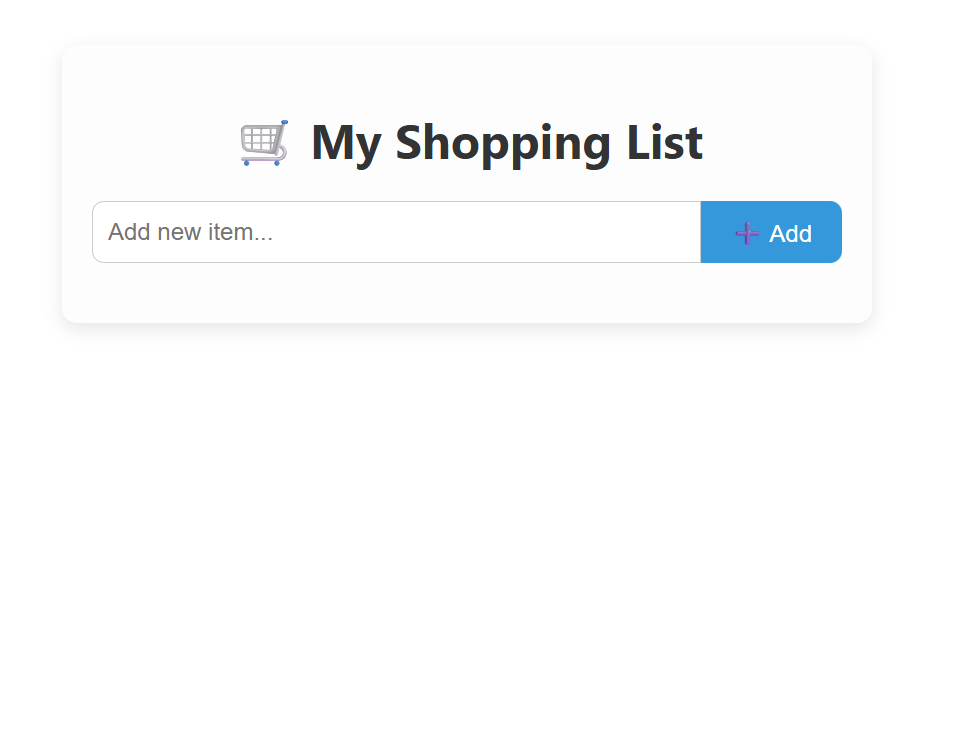
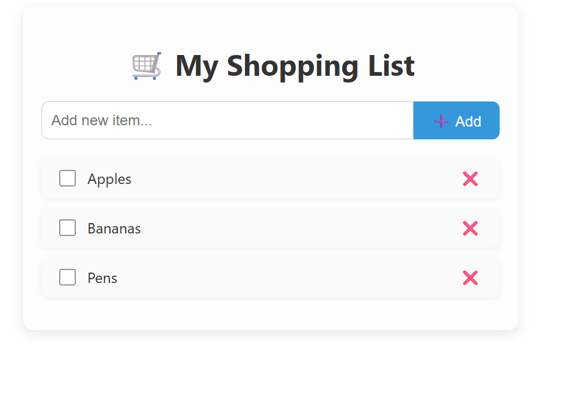
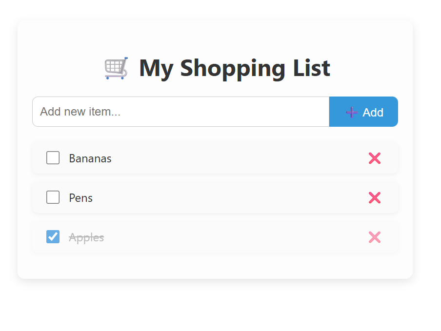

# Shopping List

  

Welcome to the **Shopping List** App!

This is a .NET and React project designed to demonstrate a full CRUD application.

It allows users to view a shopping list of items from an external API and perform CRUD operatinos on them!

## Requirements

- [x] This is a CRUD Shopping List App with React and .NET Web API.
- [x] Users should be able to cross items from the shopping-list without deleting them. You can use a IsPickedUp boolean for that.
- [x] You should create two projects: A .NET WebApi and a React app.
- [x] You state management libraries (i.e. Redux).

## Features

- **List View**: When the api data has been fetched, a list of items will be displayed.
- **Cross Off An Item**: Users can cross off an item. The crossed off item will be grayed out and will be moved to the bottom of the list.
- **Remove An Item**: Users can also delete an existing item.

## Technologies

- .NET
- React
- CSS
- JavaScript
- Entity Framework Core
- SQL Server

## Getting Started

The InitialCreate database migration has been created. You will need to update database. 

### Prerequisites

- .NET 8 SDK.
- A code editor like Visual Studio or Visual Studio Code.
- SQL Server.
- SQL Server Management Studio (optional).
- Node.js
- NPM

### Installation

1. Clone the repository:
	- `git clone https://github.com/Jinboi/React.ExternalApi.git`

2. Navigate to the API project directory:
	- `cd React.ShoppingList\React.ShoppingList.Server`
	
3. Configure the application:
	- Update the connection string in `appsettings.json` if you require.
	
4. Build the application using the .NET CLI:
	- `dotnet build`

5. Navigate to the Web project directory:
	- `cd React.ShoppingList.Server\shopping-list-app`

6. Install dependencies:
	- `npm install`

### Running the Application

1. Run the API application using the .NET CLI in the API project directory:
	- `dotnet run`

2. Start the development server in the Web project directory:
	- `npm start`

## Usage

Once the Web application is running:

- Loading Data message will show while fetch api is run.
- View a list of shopping list.
- Users can cross off an item on the list.
- Users can create a new item on the list.
- Users can delete an existing item on the list.
- If Error message is returned, check API is running, check port running on.

### Loaded Page

### Add Items

### Crossed Off An Item

## How It Works

- **API Integration**: Fetch is used to call the External API.
- **Data Access**: Interaction with the database is via Entity Framework Core.

---
***Shopping List is everything!***
